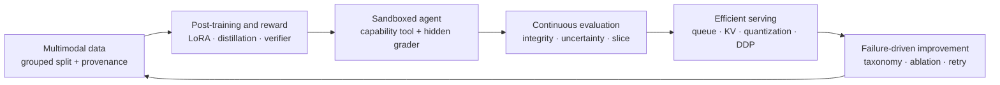
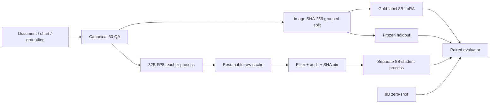

# Foundation Model Lab

[포트폴리오 요약](PORTFOLIO.md) ·
[Evidence scorecard](public-evidence/meta/portfolio-scorecard/scorecard.svg) ·
[Scorecard JSON](public-evidence/meta/portfolio-scorecard/scorecard.json) ·
[English README](README.md) · [Frontier 역할 정합성](docs/frontier_role_alignment.md) ·
[2026-08-04 frontier-systems 결과](docs/results_2026-08-04-frontier-systems.md) ·
[공개 evidence 인덱스](public-evidence/README.md) ·
[공개 evidence 정책](docs/public_evidence.md) · [연구 프로토콜](docs/research_protocol.md) ·
[VLM 트랙](docs/vlm_track.md) ·
[2026-08-04 실제 VLM GPU smoke](docs/results_2026-08-04-vlm-gpu-smoke.md) ·
[2026-08-03 VLM 결과](docs/results_2026-08-03-vlm.md) ·
[오픈소스 공개 정책](docs/open_source_release.md)

파운데이션 모델의 핵심 아이디어를 작은 비용으로 직접 구현하고, 학습 과정·실패·자원
비용을 재현 가능한 산출물로 남기는 온프레미스 연구 저장소다. Transformer와 tokenizer를
처음부터 만드는 교육용 실험, 로컬 Qwen 계열 파인튜닝·LoRA·QLoRA·양자화·증류,
Qwen3-VL 두 트랙, 특징적인 ML 문제, 제한된 도구를 사용하는 코드 작성 에이전트를 한
실험 시스템으로 구성했다.

self-contained reviewer UI는 [`site/`](site/)에 있으며 최소 권한
[Pages workflow](.github/workflows/pages.yml)로 배포한다. 로컬 재생성·미리보기:

```bash
python scripts/build_portfolio_site.py
make site-check
python -m http.server 8000 --directory site
```


이 저장소는 모델 동물원이 아니다. 각 주장을 다음 다섯 단계로 분리한다.

| 단계 | 최소 증거 | 허용되는 해석 |
|---|---|---|
| **Wiring** | 비교 주장이 없는 deterministic mock/tiny 경로 | 데이터·loss·optimizer·report 경로가 연결됨 |
| **Smoke** | 실제 로컬 모델의 제한된 추론 또는 1–5 optimizer step | 이 호스트에서 모델 API·메모리·gradient 경로가 동작함 |
| **Controlled study** | 출처가 명시된 synthetic/simulator/actual-CPU testbed, 기준선·negative control, 반복 trial 또는 불변식 gate | 해당 testbed 안의 메커니즘·평가기·correctness 결과 |
| **Experiment** | 고정 grouped holdout, 기준선, 최소 3개 seed | 이 데이터셋에서 통제된 비교 결과 |
| **Benchmark** | 공개 프로토콜과 경쟁 기준선 | 해당 공개 프로토콜 범위의 벤치마크 주장 |

`simulated: true`인 정확도와 loss는 모델 품질이 아니다. 실제 모델 한 샘플 추론이나
두 step 학습도 benchmark가 아니라 smoke다.

## 현재 증거

| 트랙 | 현재 수준 | 확인된 사실 |
|---|---|---|
| Qwen3-VL-8B 문서 추론 | **Smoke** | 로컬 BF16 모델이 한 이미지에서 `297.00`을 생성함. 단일 샘플이므로 일반화하지 않음 |
| 실제 Qwen3-VL 전처리 | **real_processor_wiring** | 실제 processor와 이미지 2개로 multimodal batch·assistant-only label을 검증함. weight는 미적재 |
| Qwen3-VL-8B LoRA | **Smoke — actual GPU** | 로컬 BF16 8B가 vision tower를 동결한 채 assistant-only LoRA optimizer step 2회를 완료함. 합성 holdout 3개가 학습 전부터 100%라 품질 향상 주장은 하지 않음 ([공개 evidence](public-evidence/vlm/qwen3-vl-8b-lora-real-2step/)) |
| 32B→8B response distillation | **Wiring + 실제 teacher 실패 기록** | cache·audit·SHA 검증·student LoRA mock 경로를 검증함. 실제 32B FP8 모델은 적재됐지만 선택된 kernel에서 첫 응답 전에 실패해 teacher row가 0개이며 distillation 결과는 없음 |
| Visual reward 환경 | **Controlled study — scripted/synthetic** | held-out candidate 60개, preference pair 24개, reward-hacking challenge 24개로 robust verifier와 naive reward를 비교함. candidate는 VLM 출력이 아님 ([공개 evidence](public-evidence/vlm/visual-reward-environment/)) |
| 신뢰 가능한 agent 평가기 | **Controlled study — scripted controls** | 실제 local process 24 episode에서 oracle harness control 100%와 shortcut security control 0%를 분리함. LLM 성능 결과가 아님 ([공개 evidence](public-evidence/agent/reliable-agent-benchmark/)) |
| Inference dynamics | **Controlled study — simulator + actual CPU probe** | paired simulator trial 81개로 load knee를 측정하고, 별도 tiny decoder는 dequantized fake-INT8/INT4 CPU fidelity를 측정함. integer-kernel 가속 결과가 아님 ([공개 evidence](public-evidence/systems/inference-dynamics/)) |
| 2-rank DDP correctness | **Controlled study — actual CPU/Gloo** | 실제 2-process job 3개에서 global-batch parity와 bitwise-exact resume를 tiny float64 workload로 검증함 ([공개 evidence](public-evidence/distributed/ddp-correctness/)) |
| 로컬 Qwen LLM 적응 | **Smoke** | CPT, SFT, LoRA, QLoRA, DPO, KD, 양자화를 제한된 실제 실행으로 확인 |
| From-scratch / ML / code agent | **Measured toy 또는 Smoke** | attention 시각화, 합성 ML 비교, Podman 격리 도구 trace를 저장 |

VLM의 최신 실제 GPU 수치와 주장 경계는
[2026-08-04 GPU smoke 보고서](docs/results_2026-08-04-vlm-gpu-smoke.md), 이전 multimodal
계약은 [2026-08-03 결과 보고서](docs/results_2026-08-03-vlm.md), 기존 전체 실행은
[2026-08-01 보고서](docs/results_2026-08-01.md)에 있다.

전체 공개 bundle은 [public-evidence 인덱스](public-evidence/README.md)에서 claim level,
원본 hash, sanitization manifest와 함께 탐색할 수 있다.

## 통합 연구 아키텍처

프로젝트는 서로 분리된 데모 모음이 아니라 하나의 관찰 가능한 학습·배포 loop로 구성했다.



이 구조는 기존 VLM 줄기에 저비용 systems study 네 개를 연결한다. 특정 frontier 기업의
인프라, production reliability, S-tier 채용 기준과 동등하다고 주장하지 않는다. 제한된
testbed 안에서 같은 종류의 연구 판단과 시스템 설계를 검토 가능하게 만드는 것이 목적이다.

### 포트폴리오 강화 트랙 4종

1. **Visual reward와 preference plumbing:** deterministic synthetic holdout 12개에 scripted
   candidate family 5종을 적용해 60개 candidate를 평가했다. Robust preference accuracy는
   100%, naive substring reward는 45.8%였고 paired delta는 54.2%p였다(bootstrap 95% CI
   39.6–68.8, 비교 48개). 공격 24개에서 false acceptance는 100%→0%, detector
   precision/recall은 모두 100%, clean false positive는 0개였다. 이는 environment/grader
   결과이며 VLM·online RL·human preference 결과가 아니다. [설계](docs/visual_reward_environment.md) ·
   [공개 evidence](public-evidence/vlm/visual-reward-environment/)
2. **신뢰 가능한 code-agent 평가:** immutable Python microtask 12개 × deterministic control
   2종으로 실제 local process episode 24개를 실행했다. Oracle harness control의 integrity
   pass@1은 100%, adversarial shortcut control은 0%, reward-hack detection은 100%였다.
   transient fault 5개는 한 번의 retry 안에 회복했고 재실행은 24개를 모두 resume했다.
   `process` mode는 network를 격리하지 않으며 security boundary가 아니다.
   [평가 계약](docs/agent_benchmark.md) · [공개 evidence](public-evidence/agent/reliable-agent-benchmark/)
3. **Inference dynamics와 capacity knee:** discrete-event simulator에서 정확히 81 trial =
   arrival rate 9개 × seed 3개 × scheduler policy 3개를 실행했다. 설정된 service-time·SLO·KV
   가정에서 static FCFS는 configured 24→32 rps(realized mean 29.86→39.79), continuous
   FCFS는 32→48(39.79→59.60) 사이에서 sustainable→failure로 바뀌었다. 이는 simulator-only
   interval이며 vLLM·GPU·production capacity 실측이 아니다. 별도 actual CPU tiny decoder의
   fake INT8/INT4 top-1 agreement는 1.0이지만 FP32 kernel이므로 정수 kernel 가속 주장이 아니다.
   [설계](docs/inference_dynamics.md) · [공개 evidence](public-evidence/systems/inference-dynamics/) ·
   [통합 보고서](docs/results_2026-08-04-frontier-systems.md)
4. **Distributed correctness와 exact resume:** 실제 two-rank CPU/Gloo job 3개로 uninterrupted,
   atomic checkpoint, fresh-process resume를 single-process global-batch reference와 비교했다.
   gradient max absolute/relative error는 `1.11e-16`/`1.38e-15`, final weight error는
   `2.78e-17`, resumed state/loss error는 `0.0`이었다. sample 16개는 overlap·missing·duplicate
   없이 처리됐고 changed-contract와 corrupt-byte checkpoint는 fail closed했다. NCCL·multi-node·
   production scaling 근거는 아니다. [프로토콜](docs/distributed_correctness.md) ·
   [공개 evidence](public-evidence/distributed/ddp-correctness/)

## VLM 2종: 연구 질문과 시스템 설계

두 트랙은 같은 이미지 단위 split과 held-out 평가 계약을 공유한다.

1. **Gold-label LoRA:** vision encoder를 동결한 8B에 작은 adapter를 붙였을 때
   문서·차트·grounding 적응이 가능한가?
2. **Response distillation:** 감사 가능한 32B teacher 응답이 같은 8B gold-only LoRA보다
   나은가?



### Track A — 자원 제한 Qwen3-VL-8B LoRA

핵심 구현은 [실행기](scripts/run_vlm_lora.py),
[학습 루프](src/fmlab/vlm/lora_e2e.py),
[multimodal collator](src/fmlab/vlm/lora_data.py),
[설정](configs/vlm/qwen3_vl_8b_lora_e2e.yaml)이다.

- 실제 이미지 내용의 SHA-256으로 질문들을 묶어 train/eval 누수를 막는다.
- prompt-only와 정답을 포함한 sequence를 각각 처리하고 exact prefix를 확인한다.
- image token, prompt, padding은 `-100`; assistant 답변 suffix만 CE loss에 참여한다.
- sequence나 답변을 조용히 자르지 않고 예외로 실패시킨다.
- vision encoder는 동결하고 language attention의 `q/k/v/o`에 rank-8 LoRA만 붙인다.
- 한 CUDA device를 명시하며 `device_map=auto` 학습을 허용하지 않는다.
- pixel 65,536–401,408, 기본 2 step, 24 GiB free-VRAM으로 제한하고 학습 루프에
  15분 cooperative time budget을 둔다. 모델 적재·평가 전체의 hard deadline은 아니다.
- adapter 저장은 기본 비활성화하며 필요할 때만 adapter-only로 남긴다.

실제 processor 검증은 2개 예제를 0.215초에 처리했다. `input_ids [2,403]`,
`pixel_values [2992,1536]`, 각 `[1,44,34]` grid와 374 visual token, assistant token
13/12개, padding label 위반 0개였다. 이것은 실제 전처리 배선 증거지만 weight forward나
optimizer 증거는 아니다.

최종 task-aware mock은 canonical 60개를 train/eval 45/15, 이미지 그룹 9/3으로 분할했고
겹침은 없었다. 전체 task 구성은 train `chart 15 / document 18 / grounding 12`, eval
`chart 5 / document 6 / grounding 4`다. 실제 budget에는 train 16개를 `6/5/5`, eval
3개를 task당 1개씩 넣었다. 3-step tiny loss `5.525444746`은 Qwen3-VL 품질이 아니라
optimizer 배선용으로 생성된 값이다.

이후 실제 GPU smoke는 BF16 전체 `8,774,791,408` parameter를 적재하고 vision tower를
동결한 채 text attention `q/k/v/o`의 LoRA `7,667,712`개(`0.08738%`)만 학습했다.
optimizer step 2회에서 assistant supervised token 44개를 30.28 token/s로 처리했다.
model load 34.26초, 학습 1.45초, 전체 36.75초였고 학습 peak allocated memory는
17.45 GiB였다. image-group-disjoint 합성 holdout 3개는 학습 전후 모두 exact match
100%로 delta 0, bootstrap 95% CI `[0,0]`였다. 기준선이 이미 완벽했으므로 품질 향상이나
warm-cache latency 차이에 따른 속도 향상을 주장하지 않는다.
[결과](public-evidence/vlm/qwen3-vl-8b-lora-real-2step/result.json) ·
[HTML 보고서](public-evidence/vlm/qwen3-vl-8b-lora-real-2step/report.html) ·
[claim manifest](public-evidence/vlm/qwen3-vl-8b-lora-real-2step/evidence_manifest.json)

### Track B — provenance-aware 32B→8B response distillation

[구현](src/fmlab/vlm/response_distillation.py)과
[설정](configs/vlm/response_distillation_e2e.yaml)은 sequence-level distillation을 세 개의
프로세스로 나눈다.

1. 32B FP8 teacher가 greedy 응답을 bounded JSONL cache에 원자적으로 저장한다.
2. teacher 프로세스를 종료해 VRAM을 반환한다.
3. cache를 audit한 뒤 별도 8B student LoRA 프로세스를 실행한다.

재개 시 manifest·model metadata·decoding·pixel budget·split의 계약 SHA와 기존 cache SHA를
모두 비교한다. cache row는 image SHA, split, 생성 시간, latency, backend,
`teacher_simulated`를 보존한다. `teacher_simulated`는 정확한 JSON boolean이어야 하며 실제
학습에서는 simulated target을 기본 거부한다. audit는 누락 이미지, 이미지 hash 불일치,
중복, refusal, placeholder, 길이 위반, split 누수를 검사하고 rejection reason을 남긴다.
student는 accepted-cache SHA와 row 수가 audit와 같은지 다시 확인한다.

full mock은 60개를 모두 받은 simulated teacher로 train/eval 45/15, image group 9/3,
겹침 0을 확인했다. task는 document 24, chart 20, grounding 16이다. mock loss
`2.052309 → 1.115530`은 `quality_evaluated: false`이며 orchestration 외의 품질 주장을
지원하지 않는다.

## 이 호스트에서의 자원 경계

검증 장비는 RTX PRO 6000 Blackwell 약 95 GiB, compute capability 12.0이다. 최신 실행에서는
GPU가 비어 8B의 24 GiB gate와 32B teacher의 48 GiB gate가 모두 통과했다.

- 실제 8B BF16 LoRA smoke는 2 step을 완료했고 학습 peak allocated memory는 17.45 GiB였다.
- 실제 32B FP8 teacher는 모델 적재와 약 32.6 GiB 할당까지 진행했다.
- 첫 generation에서 Transformers가 선택한 `kernels-community/finegrained-fp8` v1이
  Blackwell runtime에서 `Unknown recipe`를 내며 실패했다.
- 최신 v4는 API가 달라 현재 Transformers integration에 그대로 교체할 수 없었다.

teacher cache row는 0개라 audit·student 실제 실행으로 이어지지 않았다. 따라서 실제 8B의
gradient path만 smoke로 주장하며, 32B generation 성공이나 distillation 품질은 주장하지
않는다. 이 32B 실패는 로컬 실패 artifact로만 보존하고 공개 bundle에는 넣지 않았다.

## 재현 방법

모든 명령은 환경 활성화를 명시한다. 모델은 기존 공유 경로를 직접 참조하고 복사하거나
다운로드하지 않는다. 추적되는 [.env.example](.env.example)은 portable placeholder만
포함한다. Git에서 제외되는 `.env`로 복사한 뒤 두 root 경로만 로컬 환경에 맞게 수정한다.

```bash
cd /path/to/foundation-model-lab
python3.12 -m venv .venv
source .venv/bin/activate
python -m pip install --upgrade pip
python -m pip install torch --index-url https://download.pytorch.org/whl/cpu
python -m pip install -e '.[dev,ml,vlm]'
cp .env.example .env
# .env의 FMLAB_DATA_ROOT와 FMLAB_MODEL_ROOT를 수정한다.
source scripts/env.sh
python -m fmlab.cli doctor
pytest -q
```

최종 clean verification은 154개를 수집해 **153 passed, GPU-only regression 1 skipped**였고,
Ruff lint clean, **134 Python files formatted**였다. 이 수치는 최종 CPU/offline gate에서 다시 측정했다.

canonical manifest 준비:

```bash
source .venv/bin/activate
source scripts/env.sh
python scripts/prepare_vlm_manifests.py
```

실제 processor와 collator만 검증:

```bash
source .venv/bin/activate
source scripts/env.sh
python scripts/check_vlm_processor.py \
  --model-path "$FMLAB_MODEL_ROOT/Qwen/Qwen3-VL-8B-Instruct" \
  --manifest "$FMLAB_DATA_ROOT/datasets/vlm/mixed/manifest.jsonl" \
  --output-dir "$FMLAB_DATA_ROOT/artifacts/vlm/qwen3-vl-real-processor-check"
```

LoRA wiring:

```bash
source .venv/bin/activate
source scripts/env.sh
python scripts/run_vlm_lora.py \
  --config configs/vlm/qwen3_vl_8b_lora_e2e.yaml \
  --backend mock \
  --max-steps 3 \
  --artifact-dir "$FMLAB_DATA_ROOT/artifacts/vlm/qwen3-vl-8b-lora-mock-task-aware"
```

실제 LoRA smoke는 같은 명령에 `--backend local --max-steps 2`를 사용한다. 위 공개
bundle은 adapter를 저장하지 않은 bounded gradient smoke이며, 실제 adapter가 필요할 때만
`--save-adapter`를 추가한다.

Distillation 전체 wiring:

```bash
source .venv/bin/activate
source scripts/env.sh
python -m fmlab.vlm.response_distillation mock \
  --manifest "$FMLAB_DATA_ROOT/datasets/vlm/mixed/manifest.jsonl" \
  --output-dir "$FMLAB_DATA_ROOT/artifacts/vlm/response-distillation-mock-full" \
  --max-examples 60 \
  --max-steps 5
```

실제 `cache-teacher → audit → train-student` 명령과 안전 gate는
[response-distillation 프로토콜](docs/vlm_response_distillation.md)에 있다.

## Held-out 평가와 Experiment 승격 조건

[CPU evaluator](src/fmlab/vlm/distillation_evaluation.py)는 생성과 평가를 분리한다. base 8B,
gold-label LoRA, distilled LoRA, 선택적 teacher의 동일 example prediction JSONL을 정렬하고,
train image와 겹치면 실패한다. task slice, exact match, ANLS, type-aware accuracy, paired
bootstrap interval, teacher-gap recovery, 실패 gallery를 JSON과 HTML로 만든다.

```bash
source .venv/bin/activate
source scripts/env.sh
python scripts/evaluate_vlm_distillation.py \
  --base "$FMLAB_DATA_ROOT/predictions/vlm/base_8b.jsonl" \
  --gold "$FMLAB_DATA_ROOT/predictions/vlm/gold_lora.jsonl" \
  --distilled "$FMLAB_DATA_ROOT/predictions/vlm/distilled_lora.jsonl" \
  --teacher "$FMLAB_DATA_ROOT/predictions/vlm/teacher_32b.jsonl" \
  --train-manifest "$FMLAB_DATA_ROOT/generated/vlm/distillation/teacher-32b-accepted.jsonl" \
  --output-dir "$FMLAB_DATA_ROOT/artifacts/vlm/distillation-heldout"
```

감사된 distillation cache를 넘기면 `--train-manifest`는 `split=train` 행만 누수 검사에 쓴다.
실제 single-seed 평가도 `heldout_comparison`일 뿐 **Experiment가 아니다.** 다음 조건을
모두 만족할 때만 승격한다.

1. 고정된 image-SHA split과 공개된 데이터 버전
2. 동일한 prompt, decoding, pixel, step budget
3. 8B zero-shot과 gold-label LoRA 기준선
4. seed 7, 17, 29의 최소 3회 반복
5. paired interval, task slice, 실패 사례, VRAM·시간·adapter byte 공개

## 신규 트랙 standalone 실행

각 블록은 repository root에서 독립적으로 복사해 실행할 수 있다. 먼저 `.venv`와 `.env`가
위 재현 절차대로 준비되어 있어야 한다.

Visual reward는 scripted candidate만 평가하며 VLM을 호출하지 않는다.

```bash
source .venv/bin/activate
source scripts/env.sh
python scripts/run_visual_reward_lab.py \
  --config configs/vlm/visual_reward_environment.yaml
```

Agent evaluator는 deterministic oracle/adversarial control을 local `process` runner에서
실행한다. 이 mode를 untrusted generated code의 보안 경계로 사용하면 안 된다.

```bash
source .venv/bin/activate
source scripts/env.sh
python scripts/run_agent_benchmark.py \
  --config configs/agent/reliable_agent_benchmark.yaml
```

Inference 명령에서 scheduler·KV·capacity는 simulator이고, tiny decoder만 actual CPU
measurement다. Fake INT8/INT4는 dequantized weight와 FP32 kernel을 사용한다.

```bash
source .venv/bin/activate
source scripts/env.sh
python scripts/run_inference_dynamics.py \
  --config configs/systems/inference_dynamics.yaml
```

다음은 simulator가 아니라 실제 2-rank CPU/Gloo DDP correctness 실행이다.

```bash
source .venv/bin/activate
source scripts/env.sh
python scripts/run_ddp_correctness.py \
  --config configs/distributed/ddp_cpu.yaml
```

## 저장 공간

최종 release 측정에서 생성 cache를 제외한 repository는 **4.0 MiB**였고, 그 안의 static
Pages site는 **1.2 MiB**, public evidence는 **868 KiB**였다. 외부 lab root는 **675 MiB**로,
env 560 MiB, cache 104 MiB, runtime artifact 5.8 MiB, tmp 5.3 MiB다. 기존
Qwen3-VL-8B 약 17 GB와 32B FP8 약 34 GB는 공유 모델 경로에서 읽으므로 새로 사용한
용량에 포함하지 않는다.

rank-8 `q/k/v/o`는 정확히 7,667,712개 trainable parameter다. raw BF16 weight는 약
14.6 MiB, PEFT가 FP32로 저장하면 약 29.3 MiB이므로 adapter당 약 15–31 MiB를 잡는다.
optimizer state를 저장하지 않고 adapter-only로 두 트랙을 실행하면 추가 공간은 1 GB보다
충분히 작다. full checkpoint 또는 optimizer state를 보존하면 이 예산을 넘을 수 있어
bounded 설정에서는 비활성화했다.

로컬 산출물은 다음 경로에 있으며 Git에 포함하지 않는다.

```text
${FMLAB_DATA_ROOT}/artifacts
${FMLAB_DATA_ROOT}/adapters
${FMLAB_DATA_ROOT}/generated/vlm/distillation
```

## 더 넓은 연구 트랙

- [LLM 연구 트랙](docs/llm_track.md): from-scratch Transformer, CPT/SFT, LoRA/QLoRA, DPO,
  KD, 양자화, RAG
- [ML 연구 트랙](docs/ml_track.md): DDPM, contrastive learning, 이상탐지, 시계열, GNN,
  calibration
- [코드 에이전트](docs/code_agent.md): 로컬 coder 모델과 제한된 도구 loop
- [에이전트 보안 경계](docs/agent_security.md): rootless Podman, network·capability·resource 제한
- [Visual reward 환경](docs/visual_reward_environment.md): hidden state, verifier, preference,
  reward-hacking negative control
- [Agent benchmark](docs/agent_benchmark.md): immutable task, hidden grader, retry ledger, integrity
- [Inference dynamics](docs/inference_dynamics.md): batching, queue, paged KV, SLO, capacity, CPU probe
- [Distributed correctness](docs/distributed_correctness.md): actual CPU/Gloo DDP, accumulation, exact resume
- [Frontier 역할 정합성](docs/frontier_role_alignment.md): 공개 채용 신호와 남아 있는 evidence gap

구현은 공식 [Qwen3-VL](https://github.com/QwenLM/Qwen3-VL),
[Transformers multimodal chat template](https://huggingface.co/docs/transformers/chat_templating_multimodal),
[PEFT LoRA](https://huggingface.co/docs/peft/package_reference/lora) 계약을 기준으로 했다.

## 제한과 공개 경계

- 실제 8B 실행은 합성 holdout 3개와 optimizer 2 step의 smoke다. gradient·memory path
  실행은 증명하지만 convergence, 일반화, 품질 향상 또는 inference speedup은 증명하지 않는다.
- 32B teacher는 FP8 kernel compatibility 실패 뒤 row를 0개 남겼으므로 실제
  32B→8B distillation 결과는 없다.
- canonical VLM 데이터는 작고 합성이다. 배선과 실패 slice를 검증하지만 실제 문서 분포를
  대표하지 않는다.
- response distillation은 teacher 오류를 복제할 수 있고 logit-level dark knowledge를
  전달하지 않는다.
- 기본 step 수는 convergence가 아니라 빠른 실패 탐지에 맞췄다.
- 로컬 model weight, adapter, teacher cache, private data, workstation 경로는 공개 저장소에
  넣지 않는다.
- Visual reward candidate와 agent policy는 scripted control이다. 그 점수는 reward와
  evaluator 동작을 검증하지만 VLM·LLM 성능을 증명하지 않는다.
- scheduler·queue·paged KV·fault·capacity 수치는 deterministic simulator 출력이다. Tiny
  decoder는 actual CPU 측정이지만 INT8/INT4는 dequantized weight와 FP32 kernel을 사용한다.
- DDP는 tiny deterministic workload에서 실제 2-rank CPU/Gloo correctness를 보였을 뿐,
  NCCL·multi-node·elastic·FSDP/ZeRO 또는 production scaling 근거가 아니다.
- 특정 기업·연구소·직급·production platform과 동등하다고 주장하지 않는다. 이 저장소는
  제한된 범위의 연구·시스템 역량과 남은 gap을 명시한다.

공개 전에는 [오픈소스 체크리스트](docs/open_source_release.md)에서 upstream model license,
데이터 권리, secret·hostname·절대경로, 대용량 artifact 제외 여부를 확인한다. Raw runtime
directory를 복사하지 않고 allowlist 기반 [public-evidence exporter](docs/public_evidence.md)로
sanitized derivative만 `public-evidence/`에 둔다. 연구 결과를 인용할 때는 repository의
[citation metadata](CITATION.cff)를 사용한다.
