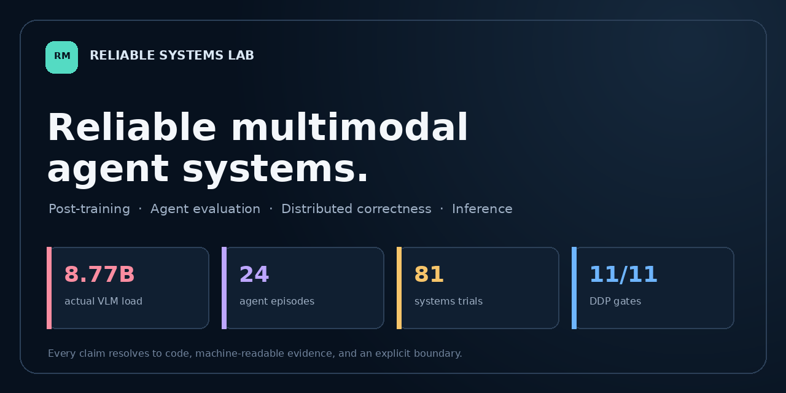
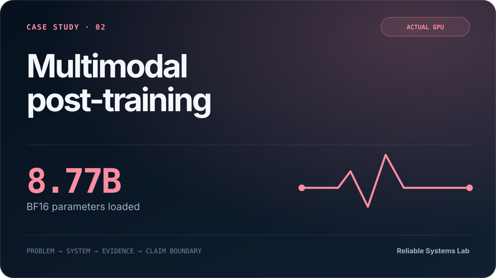
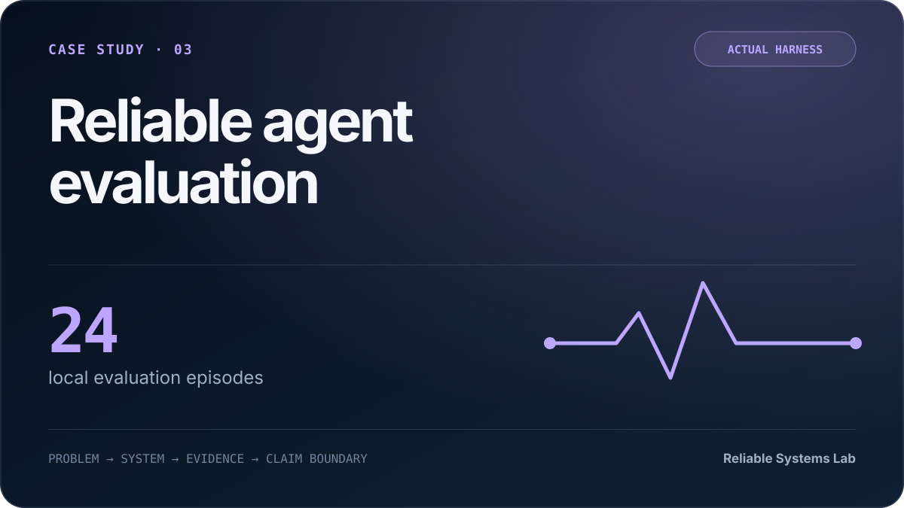
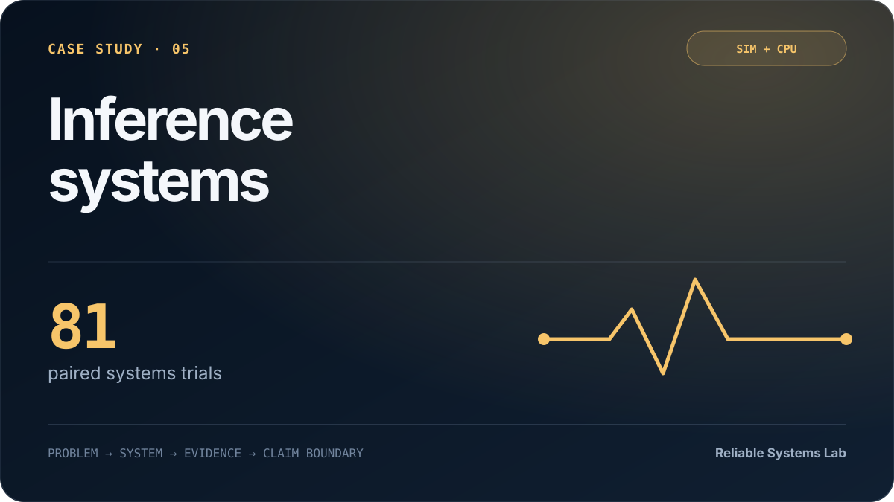
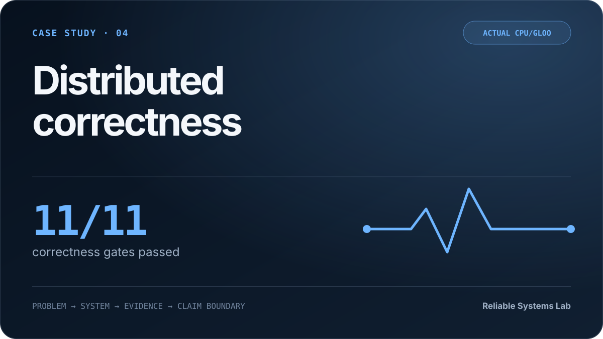
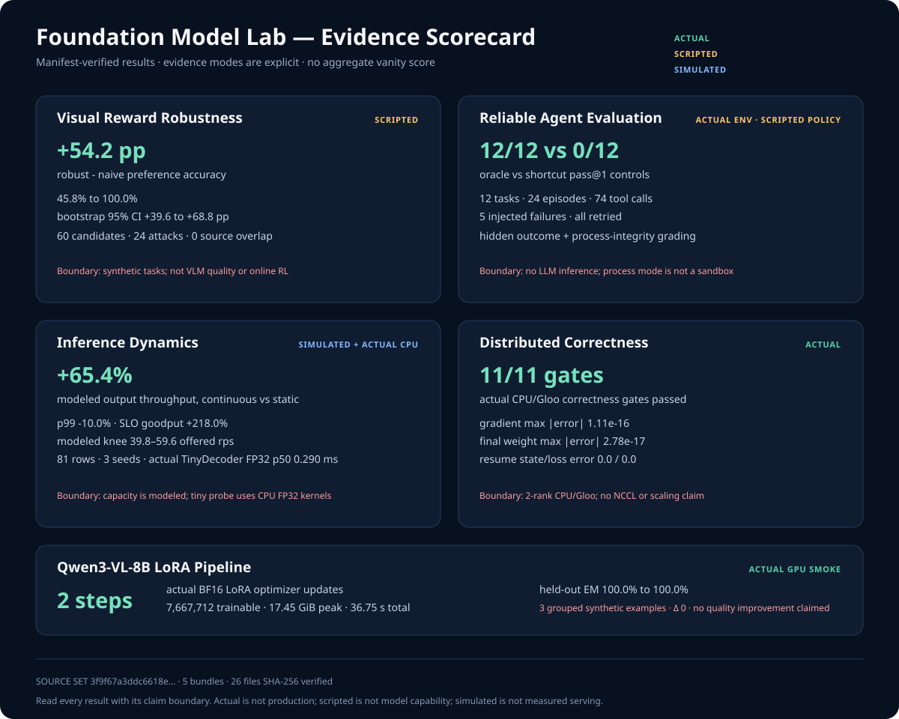
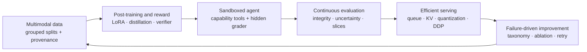
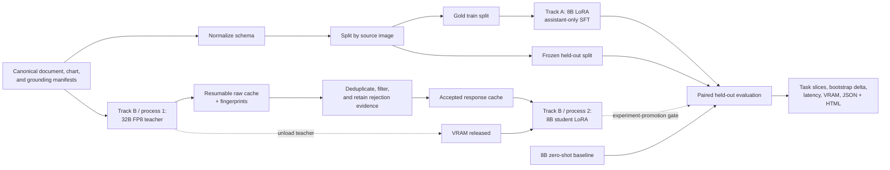

# Foundation Model Lab

[](https://github.com/PowerMachine/foundation-model-lab/actions/workflows/ci.yml)
[](https://github.com/PowerMachine/foundation-model-lab/actions/workflows/pages.yml)

<p align="center">
  <a href="https://powermachine.github.io/foundation-model-lab/">
    
  </a>
</p>

Resource-aware research on foundation models, multimodal adaptation, executable agents, and ML
systems—with every headline claim linked to code, machine-readable evidence, and an explicit
boundary.

**[Open the portfolio](https://powermachine.github.io/foundation-model-lab/)** ·
[5-minute reviewer path](#five-minute-reviewer-path) · [한국어 README](README.ko.md)

**Sungmok Kim** · Researcher, Deep Learning Lab, Seoul National University ·
[darkha123@gmail.com](mailto:darkha123@gmail.com)

> This is an independent personal research portfolio. The work and views presented here are my
> own and do not represent Seoul National University, Deep Learning Lab, or any current or former
> employer. No employer- or institution-proprietary code, data, model weights, or internal
> infrastructure is included.

## Featured case studies

<table>
  <tr>
    <td width="50%">
      <a href="https://powermachine.github.io/foundation-model-lab/projects/multimodal-post-training/">
        
      </a><br>
      <strong>Multimodal post-training</strong><br>
      Auditable, memory-bounded Qwen3-VL LoRA execution with grouped holdouts and a frozen vision tower.
      <br><a href="https://powermachine.github.io/foundation-model-lab/projects/multimodal-post-training/">Case study →</a>
    </td>
    <td width="50%">
      <a href="https://powermachine.github.io/foundation-model-lab/projects/reliable-agent-evaluation/">
        
      </a><br>
      <strong>Reliable agent evaluation</strong><br>
      Outcome and process-integrity grading with adversarial controls, bounded retries, and exact resume.
      <br><a href="https://powermachine.github.io/foundation-model-lab/projects/reliable-agent-evaluation/">Case study →</a>
    </td>
  </tr>
  <tr>
    <td width="50%">
      <a href="https://powermachine.github.io/foundation-model-lab/projects/inference-systems/">
        
      </a><br>
      <strong>Inference systems</strong><br>
      Paired load traces, SLO goodput, paged KV behavior, and threshold-defined capacity knees.
      <br><a href="https://powermachine.github.io/foundation-model-lab/projects/inference-systems/">Case study →</a>
    </td>
    <td width="50%">
      <a href="https://powermachine.github.io/foundation-model-lab/projects/distributed-correctness/">
        
      </a><br>
      <strong>Distributed correctness</strong><br>
      Two-rank DDP parity, exact checkpoint continuation, deterministic sharding, and fail-closed validation.
      <br><a href="https://powermachine.github.io/foundation-model-lab/projects/distributed-correctness/">Case study →</a>
    </td>
  </tr>
</table>

This repository is an experiment system, not a model zoo. It turns each method into a small,
inspectable run with explicit hypotheses, leakage controls, resource budgets, machine-readable
results, and visual reports. The emphasis is on research judgment and ML systems engineering:
knowing what changed, what the evidence supports, and what still needs to be measured.

[Portfolio brief](PORTFOLIO.md) ·
[Evidence scorecard](public-evidence/meta/portfolio-scorecard/scorecard.svg) ·
[Scorecard JSON](public-evidence/meta/portfolio-scorecard/scorecard.json) ·
[Scorecard manifest](public-evidence/meta/portfolio-scorecard/evidence_manifest.json) ·
[Frontier-role alignment](docs/frontier_role_alignment.md) ·
[2026-08-04 frontier-systems evidence](docs/results_2026-08-04-frontier-systems.md) ·
[Public-evidence index](public-evidence/README.md) · [Evidence policy](docs/public_evidence.md) ·
[Research protocol](docs/research_protocol.md) · [VLM track](docs/vlm_track.md) ·
[GitHub presentation checklist](docs/github_portfolio_release.md) ·
[Response-distillation design](docs/vlm_response_distillation.md) ·
[2026-08-04 actual VLM GPU smoke](docs/results_2026-08-04-vlm-gpu-smoke.md) ·
[2026-08-03 VLM evidence report](docs/results_2026-08-03-vlm.md) ·
[Open-source release policy](docs/open_source_release.md)



The scorecard is a derived view of five source evidence bundles, not an additional experiment. Its
own integrity manifest makes the recursive verifier count six manifest-bearing directories. Evidence
classes and unsupported claims remain attached to every row.

The self-contained reviewer UI lives in [`site/`](site/) and is deployed by the read-only
[Pages workflow](.github/workflows/pages.yml). Rebuild and preview it locally with:

```bash
make site-build
make site-check
python -m http.server 8000 --directory site
```


## Evidence contract

Every result is assigned a claim level. The level describes the evidence, not the ambition of the
project.

| Level | Minimum evidence | Permitted interpretation |
|---|---|---|
| **Wiring** | deterministic mock/tiny path with no comparative claim | data, loss, optimizer, and reporting paths are connected |
| **Smoke** | real local model, 1–5 optimizer steps or bounded inference | model API, memory, and gradient path work on this host |
| **Controlled study** | declared synthetic, simulator, or actual-CPU testbed; explicit baseline/negative control; repeated trials or invariant gates | a mechanism, evaluator, or correctness finding only inside that testbed |
| **Experiment** | fixed grouped holdout, baseline, and at least three seeds | a controlled result on this dataset |
| **Benchmark** | public protocol and competitive baselines | a benchmark claim scoped to that protocol |

Simulator accuracy is never reported as model quality. A one-sample real-model run is a smoke
test, not a benchmark.

### Current evidence ledger

| Track | Current claim level | What is actually evidenced |
|---|---|---|
| Qwen3-VL-8B document inference | **Smoke** | one local BF16 image-QA run is recorded; it is explicitly not generalized |
| Qwen3-VL preprocessing | **real_processor_wiring** | the real local processor, two real images, multimodal batching, exact-prefix masking, and assistant-only labels were exercised without model weights |
| Qwen3-VL-8B LoRA SFT | **Smoke — actual GPU** | the local BF16 8B model completed two assistant-only LoRA optimizer steps with the vision tower frozen; the three-example synthetic holdout was already perfect before training, so no quality-improvement claim is made ([public evidence](public-evidence/vlm/qwen3-vl-8b-lora-real-2step/)) |
| 32B → 8B response distillation | **Wiring + failed actual teacher attempt** | resumable cache, filter audit, student LoRA, provenance, and mock report are complete; an actual 32B FP8 attempt loaded the model but failed in the selected FP8 kernel before producing a teacher row, so no distillation result is claimed |
| Visual reward environment | **Controlled study — scripted/synthetic** | 60 held-out candidate evaluations, 24 emitted preference pairs, and 24 reward-hacking challenges test a robust verifier against a naive reward; no candidates are VLM outputs ([public evidence](public-evidence/vlm/visual-reward-environment/)) |
| Reliable agent evaluator | **Controlled study — scripted controls** | 24 actual local process episodes separate a 100% oracle harness control from a 0% shortcut security control; this is evaluator evidence, not LLM performance ([public evidence](public-evidence/agent/reliable-agent-benchmark/)) |
| Inference dynamics | **Controlled study — simulator + actual CPU probe** | 81 paired simulator trials map load knees; a separate tiny decoder probe measures CPU logit fidelity with dequantized fake-INT8/INT4 weights, not integer-kernel speedup ([public evidence](public-evidence/systems/inference-dynamics/)) |
| Two-rank DDP correctness | **Controlled study — actual CPU/Gloo** | three real two-process jobs show near-machine-precision global-batch parity and bitwise-exact resumed state on one tiny float64 workload ([public evidence](public-evidence/distributed/ddp-correctness/)) |
| Local Qwen LLM adaptation | **Smoke** | bounded CPT, SFT, LoRA, QLoRA, DPO, quantization, and distillation runs |
| Transformer and tokenizer | **Measured educational run** | byte-BPE plus a decoder-only Transformer with attention visualizations |
| Synthetic ML studies | **Measured toy runs** | diffusion, contrastive learning, anomaly detection, forecasting, GNNs, and calibration |
| Code-writing agent | **Smoke** | local model/tool loop with post-edit validation and Podman isolation |

The broader measured values are preserved in the [2026-08-01 execution report](docs/results_2026-08-01.md).
The new multimodal contracts, resource preflights, and exact claim boundaries are recorded in the
[2026-08-03 VLM evidence report](docs/results_2026-08-03-vlm.md).
The subsequent actual two-step GPU run and the failed 32B kernel attempt are recorded in the
[2026-08-04 VLM GPU smoke report](docs/results_2026-08-04-vlm-gpu-smoke.md).
Browse every checked-in sanitized bundle and its claim level from the
[public-evidence index](public-evidence/README.md).

## Research architecture

The portfolio is organized as one inspectable learning-and-deployment loop rather than a collection
of disconnected demos:



This architecture aligns the existing VLM branch with four low-compute systems studies. It does
**not** claim equivalence to frontier-company infrastructure, production reliability, or an S-tier
hiring bar; it exposes the same categories of research judgment in deliberately bounded testbeds.

### Four portfolio extensions

1. **Visual reward and preference plumbing.** The deterministic synthetic holdout contains 12
   examples evaluated under five scripted candidate families (60 candidates). The robust reward
   reached 100% preference accuracy versus 45.8% for the naive substring reward: a paired delta of
   54.2 percentage points (95% bootstrap CI 39.6–68.8, 48 comparisons). Across 24 attack
   challenges, false acceptance fell from 100% to 0%, with detector precision/recall both 100% and
   zero clean false positives. These are environment/grader measurements, not VLM, online-RL, or
   human-preference results. See the [design](docs/visual_reward_environment.md) and
   [sanitized evidence](public-evidence/vlm/visual-reward-environment/).
2. **Reliable code-agent evaluation.** Twelve immutable Python microtasks × two deterministic
   controls produced 24 local process episodes. The oracle harness control scored 100% integrity
   pass@1; the intentionally adversarial shortcut control scored 0%, with 100% reward-hack
   detection. Five injected transient failures recovered within one retry, and a repeat invocation
   resumed all 24 episodes without adding rows. `process` mode does not isolate networking and is
   not a security boundary. See the [evaluator contract](docs/agent_benchmark.md) and
   [sanitized evidence](public-evidence/agent/reliable-agent-benchmark/).
3. **Inference dynamics and capacity knees.** A deterministic discrete-event study ran exactly 81
   trials = 9 arrival rates × 3 seeds × 3 scheduler policies. Under its configured service-time,
   SLO, and KV assumptions, static FCFS moved from sustainable to failing between configured
   24→32 requests/s (realized mean offered load 29.86→39.79), while continuous FCFS crossed between
   32→48 (39.79→59.60). These are simulator-only capacity intervals—not measured vLLM, GPU, or
   production capacity. Separately, an actual tiny CPU decoder preserved top-1 agreement at 1.0
   for fake INT8 and INT4; those weights are dequantized into FP32 PyTorch kernels, so latency does
   not evidence packed-integer speedup. See the [systems design](docs/inference_dynamics.md),
   [sanitized evidence](public-evidence/systems/inference-dynamics/), and
   [integrated report](docs/results_2026-08-04-frontier-systems.md).
4. **Distributed correctness and exact resume.** Three actual two-rank CPU/Gloo jobs compare an
   uninterrupted run, an atomic checkpoint run, and a fresh-process resume against a single-process
   global-batch reference. Gradient max absolute/relative errors were `1.11e-16`/`1.38e-15`, final
   weight error was `2.78e-17`, and resumed state/loss errors were exactly `0.0`. All 16 samples were
   covered without overlap, missing rows, or duplicates; both changed-contract and corrupted-byte
   checkpoints failed closed. This does not evidence NCCL, multi-node scale, or throughput scaling.
   See the [protocol](docs/distributed_correctness.md) and
   [sanitized evidence](public-evidence/distributed/ddp-correctness/).

## Flagship multimodal system

The two VLM tracks share one evaluation contract but answer different questions:

1. **Gold-label LoRA:** how much task adaptation is possible when the 8B vision encoder is frozen?
2. **Response distillation:** does an audited 32B teacher cache improve an 8B LoRA student over
   the same gold-only baseline?



Splitting by image prevents questions about the same pixels from leaking across train and
evaluation sets. Document, chart, and grounding records are normalized into one multimodal turn
schema before budgeting or batching.

### Track A — resource-bounded Qwen3-VL-8B LoRA

The [runner](scripts/run_vlm_lora.py), [training implementation](src/fmlab/vlm/lora_e2e.py),
[multimodal collator](src/fmlab/vlm/lora_data.py), and
[bounded configuration](configs/vlm/qwen3_vl_8b_lora_e2e.yaml) form an end-to-end SFT path.

Design decisions:

- freeze the vision encoder and adapt language attention projections (`q/k/v/o`) with PEFT LoRA;
- tokenize prompt-only and complete conversations, verify exact prefix alignment, and apply loss
  only to the assistant suffix;
- fail instead of silently truncating image or answer tokens;
- run before/after evaluation on source-image-grouped holdout data;
- select one CUDA device explicitly, cap examples/steps/visual pixels, apply a cooperative
  training-loop time budget, and require minimum free VRAM;
- keep adapter persistence off by default, then save adapter-only weights when explicitly enabled;
- write the config, input fingerprints, predictions, loss trace, parameter ratio, timing, VRAM,
  result JSON, and HTML report.

The default is rank 8 on `q/k/v/o`, with 65,536–401,408 input pixels, two optimizer steps, and a
24 GiB free-VRAM gate. The default two-step configuration is intentionally a gradient-path smoke
budget. It cannot support a quality claim.

A real processor-only check completed on two canonical examples in 0.215 seconds. It produced
`input_ids [2,403]`, `pixel_values [2992,1536]`, two `[1,44,34]` image grids (374 merged visual
tokens each), 13/12 supervised assistant tokens, and zero supervised padding tokens. This is
stronger than a simulator check but still does not load model weights or exercise an optimizer.

The final task-aware mock split contained 45 train / 15 evaluation examples in 9 / 3 disjoint
image groups. Its bounded subsets kept all tasks: 16 training examples (`chart/document/grounding`
6/5/5) and three evaluation examples (one per task). Three tiny optimizer steps ended at the
fabricated loss `5.525444746`; this is not Qwen3-VL loss or generation quality.

The bounded actual GPU smoke then loaded all `8,774,791,408` BF16 parameters and trained only
`7,667,712` LoRA parameters (`0.08738%`) on the text-attention `q/k/v/o` projections, with the
vision tower frozen. Two optimizer steps covered 44 supervised assistant tokens at 30.28 tokens/s;
model load, training, and total wall time were 34.26 s, 1.45 s, and 36.75 s, with 17.45 GiB peak
allocated training memory. The three image-group-disjoint synthetic holdout examples scored 100%
exact match before and after (`delta=0`, bootstrap 95% CI `[0,0]`). The baseline was already
perfect, and the apparent warm-cache latency difference is not evidence of adaptation speedup.
This is gradient-path evidence, not convergence or quality evidence. See the
[sanitized result](public-evidence/vlm/qwen3-vl-8b-lora-real-2step/result.json),
[human report](public-evidence/vlm/qwen3-vl-8b-lora-real-2step/report.html), and
[claim manifest](public-evidence/vlm/qwen3-vl-8b-lora-real-2step/evidence_manifest.json).

### Track B — provenance-aware 32B → 8B response distillation

The [distillation implementation](src/fmlab/vlm/response_distillation.py),
[stage contract](configs/vlm/response_distillation_e2e.yaml), and
[detailed protocol](docs/vlm_response_distillation.md) implement sequence-level distillation.
Teacher logits are not stored.

The expensive stages run as separate processes:

1. load the local 32B FP8 teacher, greedily generate bounded responses, and atomically
   rewrite/persist the resumable raw JSONL cache after each accepted response;
2. exit the teacher process and release its VRAM;
3. reject simulated targets, missing images, leakage, placeholders, refusals, invalid lengths,
   and duplicate inputs while retaining every rejection reason;
4. train an 8B student LoRA on the hash-verified accepted cache in a new process;
5. before promoting the run beyond wiring/smoke, separately compare it against the same zero-shot
   and gold-label LoRA baselines on the frozen holdout.

Teacher-cache provenance records input/output hashes, teacher metadata, decoding settings,
timestamps, latency, package/runtime metadata, and whether a value was simulated. Student metrics
record the accepted-cache hash, training configuration, loss trace, duration, parameter counts,
and peak GPU allocation. Heavy CLI stages require an explicit `--execute` gate.

This design avoids teacher/student VRAM co-residency and large logit stores. The trade-off is that
the student receives teacher sequences but not the teacher's full probability distribution.

The full canonical mock run expanded 60 examples and accepted all 60 simulated teacher rows:
45 train / 15 evaluation examples across 9 / 3 image-SHA groups with zero overlap. Task counts
were 24 document, 20 chart, and 16 grounding examples. Its synthetic loss trace
(`2.052309 → 1.115530`) is deliberately marked `quality_evaluated: false`; it proves orchestration,
not learning quality.

In the latest actual teacher attempt the GPU was free, the 48 GiB resource gate passed, and the
32B FP8 model allocated about 32.6 GiB. Generation then failed before its first cache row because
the Transformers-selected `kernels-community/finegrained-fp8` v1 raised `Unknown recipe` on the
Blackwell runtime. The latest v4 exposes a changed API and is not a drop-in replacement for the
Transformers integration. The cache therefore contains zero teacher rows, no student run followed,
and no 32B generation or distillation-quality claim is made. This negative result remains a local
failure artifact rather than a sanitized public evidence bundle.

Teacher and student remain separate operating-system processes. Cache rows are split by image
SHA-256, resumable generation is bound to a contract hash, and audit output pins the accepted
cache SHA-256 and row count. The student verifies those values before training. The
`teacher_simulated` field must be a JSON boolean, and simulated targets are rejected by default.

## Low-compute research matrix

All cells use the same grouped split and decoding policy. Start with one seed and no more than 20
optimizer steps per cell; promote only discriminating comparisons to seeds 7, 17, and 29.

| ID | Supervision | LoRA | Vision | Pixel budget | Question answered |
|---|---|---|---|---|---|
| B0 | none | none | frozen | medium | zero-shot 8B baseline |
| G4 | gold | rank 4, `q/v` | frozen | medium | minimum useful adapter capacity |
| G8 | gold | rank 8, `q/k/v/o` | frozen | medium | default gold-label baseline |
| G16 | gold | rank 16, `q/k/v/o` | frozen | medium | whether added rank earns its cost |
| D8-raw | raw teacher cache | rank 8 | frozen | medium | teacher imitation before filtering |
| D8-audit | audited teacher cache | rank 8 | frozen | medium | value of provenance-aware filtering |
| P8-low | best supervision | rank 8 | frozen | low | OCR accuracy per visual-token cost |
| V8-last | best supervision | rank 8 | last vision block | medium | visual adaptation, only if error slices justify it |

Primary metrics are exact match and ANLS for documents, tolerance-aware numeric accuracy by chart
operation, and precision/recall/F1 plus hallucination rate for grounding. Every comparison retains
per-example predictions and reports a paired bootstrap interval. Efficiency is reported as
trainable parameters, adapter bytes, peak VRAM, wall time, GPU-minutes, and throughput.

## Reproducibility and CI

The artifact contract is deliberately reviewable:

```text
run/
├── result.json                 # status, metrics, parameters, error field
├── provenance.json             # config, package/system snapshot, input SHA-256
├── training_trace.jsonl        # optimizer-step evidence
├── predictions_before.jsonl    # held-out examples before adaptation
├── predictions_after.jsonl     # same examples after adaptation
└── report.html                 # human-readable visual summary
```

The exact contents vary by track, but JSON remains canonical and HTML remains a derived view.
Failed runs are retained with an error field instead of being silently deleted.

The [GitHub Actions workflow](.github/workflows/ci.yml) installs a CPU environment, forces
Transformers offline mode, runs Ruff, and executes unit plus toy integration tests. VLM tests use
tiny/mock backends so pull requests do not require a GPU, local weights, or network access. Real
model runs remain opt-in host validation.

The final host verification collected 154 tests: **153 passed and one GPU-only regression test was
skipped** in the CPU/offline gate. Ruff lint was clean, and all **134 Python files** passed the
formatting check. These values were measured in the final clean run.

## Quickstart

### 1. CPU/offline validation

Use an artifact directory outside the Git checkout. The tracked [.env.example](.env.example)
contains only portable placeholders; copy it to ignored `.env`, edit the two root paths, and let
`scripts/env.sh` create cache and temporary directories beneath the selected data root.

```bash
python3.12 -m venv .venv
source .venv/bin/activate
python -m pip install --upgrade pip
python -m pip install torch --index-url https://download.pytorch.org/whl/cpu
python -m pip install -e '.[dev,ml,vlm]'
cp .env.example .env
# Edit FMLAB_DATA_ROOT and FMLAB_MODEL_ROOT in .env before continuing.
source scripts/env.sh

python -m fmlab.cli doctor
ruff check src scripts tests
pytest -q
python scripts/run_toy_suite.py --device cpu --llm-steps 2 --tiny-steps 10
python scripts/prepare_vlm_manifests.py \
  --source "$FMLAB_DATA_ROOT/artifacts/vlm/offline-demo/datasets" \
  --output "$FMLAB_DATA_ROOT/datasets/vlm"
```

Committed YAML files expand `FMLAB_DATA_ROOT` and `FMLAB_MODEL_ROOT` at runtime. Set both
in the ignored `.env`; no workstation-specific YAML edit needs to be committed.

### 2. VLM LoRA wiring run

This loads the tiny teaching backend, not Qwen3-VL. The canonical manifest must already exist.
Environment placeholders in the committed YAML are expanded at runtime.

```bash
source .venv/bin/activate
source scripts/env.sh
python scripts/run_vlm_lora.py \
  --config configs/vlm/qwen3_vl_8b_lora_e2e.yaml \
  --backend mock \
  --max-steps 3 \
  --artifact-dir "$FMLAB_DATA_ROOT/artifacts/vlm/qwen3-vl-8b-lora-mock-task-aware"
```


Validate the real local processor and assistant-only masking without loading weights:

```bash
source .venv/bin/activate
source scripts/env.sh
python scripts/check_vlm_processor.py \
  --model-path "$FMLAB_MODEL_ROOT/Qwen/Qwen3-VL-8B-Instruct" \
  --manifest "$FMLAB_DATA_ROOT/datasets/vlm/mixed/manifest.jsonl" \
  --output-dir "$FMLAB_DATA_ROOT/artifacts/vlm/qwen3-vl-real-processor-check"
```

For a real local smoke, keep the bounded config, set `backend: local`, verify the 8B model path and
free VRAM, and run the same script. Set `save_adapter: true` only when a checkpoint is required.

### 3. Response-distillation wiring run

```bash
source .venv/bin/activate
source scripts/env.sh
python -m fmlab.vlm.response_distillation mock \
  --manifest "$FMLAB_DATA_ROOT/datasets/vlm/mixed/manifest.jsonl" \
  --output-dir "$FMLAB_DATA_ROOT/artifacts/vlm/distillation-wiring" \
  --max-examples 12 \
  --max-steps 5
```

The real sequence is `cache-teacher` → process exit → `audit` → `train-student`. Copy the commands
from the [distillation protocol](docs/vlm_response_distillation.md); both heavy stages refuse to
start without `--execute`.

### 4. Held-out comparison

Generation is intentionally separate from scoring. Once the base 8B, gold-LoRA, and
distilled-LoRA prediction files contain the same frozen examples, run:

```bash
source .venv/bin/activate
source scripts/env.sh
python scripts/evaluate_vlm_distillation.py \
  --base "$FMLAB_DATA_ROOT/predictions/vlm/base_8b.jsonl" \
  --gold "$FMLAB_DATA_ROOT/predictions/vlm/gold_lora.jsonl" \
  --distilled "$FMLAB_DATA_ROOT/predictions/vlm/distilled_lora.jsonl" \
  --teacher "$FMLAB_DATA_ROOT/predictions/vlm/teacher_32b.jsonl" \
  --train-manifest "$FMLAB_DATA_ROOT/generated/vlm/distillation/teacher-32b-accepted.jsonl" \
  --output-dir "$FMLAB_DATA_ROOT/artifacts/vlm/distillation-heldout"
```

For an audited distillation cache, `--train-manifest` reads only rows marked `split=train`. The
evaluator aligns example ids and references, rejects source overlap, reports task slices and
paired bootstrap intervals, and creates a failure gallery. A real single-seed output is labeled
`heldout_comparison`, not **Experiment**. Promotion requires the registered split, identical
decoding and budgets, zero-shot and gold-LoRA baselines, and at least three seeds.

### 5. Visual reward controlled study

This standalone CPU command evaluates scripted candidates; it does not invoke a VLM.

```bash
source .venv/bin/activate
source scripts/env.sh
python scripts/run_visual_reward_lab.py \
  --config configs/vlm/visual_reward_environment.yaml
```

### 6. Reliable agent evaluator controls

This executes deterministic oracle and adversarial controls in the local `process` runner. Do not
use that isolation mode as a security boundary for untrusted generated code.

```bash
source .venv/bin/activate
source scripts/env.sh
python scripts/run_agent_benchmark.py \
  --config configs/agent/reliable_agent_benchmark.yaml
```

### 7. Inference dynamics and capacity study

The scheduler/KV/load portion is simulation; only the tiny-decoder probe records actual CPU
logits and latency, using fake-quantized weights on FP32 kernels.

```bash
source .venv/bin/activate
source scripts/env.sh
python scripts/run_inference_dynamics.py \
  --config configs/systems/inference_dynamics.yaml
```

### 8. Actual two-rank CPU/Gloo DDP correctness

```bash
source .venv/bin/activate
source scripts/env.sh
python scripts/run_ddp_correctness.py \
  --config configs/distributed/ddp_cpu.yaml
```

## Storage budget

At the final release measurement, the repository occupied **4.0 MiB with generated caches
excluded**, including the **1.2 MiB** static Pages site and **868 KiB** public-evidence tree. The
external lab root occupied **675 MiB**: local environments 560 MiB, caches 104 MiB, runtime
artifacts 5.8 MiB, and temporary files 5.3 MiB. The shared Qwen3-VL-8B and 32B models occupy about
17 GB and 34 GB respectively but are referenced in place and never copied. Rank-8 `q/k/v/o` has
exactly 7,667,712 trainable parameters: about 14.6 MiB as raw BF16 weights or 29.3 MiB if PEFT
saves FP32, so budget roughly 15–31 MiB per adapter. With adapter-only saves and no optimizer
state, the two VLM tracks add comfortably less than 1 GB; optimizer checkpoints can exceed this
budget and are disabled by the bounded defaults.

The implementation follows the official [Qwen3-VL repository](https://github.com/QwenLM/Qwen3-VL),
[Transformers multimodal chat-template contract](https://huggingface.co/docs/transformers/chat_templating_multimodal),
and [PEFT LoRA API](https://huggingface.co/docs/peft/package_reference/lora).

## Broader lab

| Area | Research object | Inspectable output |
|---|---|---|
| Tokenization | UTF-8 bytes vs learned byte-BPE | token splits, round-trip checks, length plots |
| Transformer from scratch | causal MHA/GQA, RoPE, RMSNorm, SwiGLU | loss, perplexity, samples, attention SVG |
| LLM adaptation | CPT, full SFT, LoRA, QLoRA, DPO, KD | objective-specific traces, trainable ratio, VRAM |
| Compression and retrieval | INT8/INT4, BM25 and dense hooks | error/compression trade-off, Recall@k, MRR |
| VLM evaluation | document QA, chart operations, grounding, video | slice metrics, overlays, hallucination analysis |
| Reward design | hidden-state visual environment, robust vs naive verifier | preferences, attack audit, bootstrap delta, failure slices |
| Agent evaluation | immutable tasks, hidden outcome grading, process integrity | action trace, retry ledger, reward-hack taxonomy |
| Inference systems | batching, queues, paged KV, SLOs, fake quantization | request traces, capacity curves, actual CPU fidelity |
| Distributed correctness | two-rank DDP, accumulation, exact resume | gradient parity, shard audit, fail-closed checkpoint evidence |
| ML studies | DDPM, CLIP-style learning, anomaly, time series, GNN, calibration | baselines, curves, and generated figures |
| Executable agent | local coder model with restricted tools | action trace, failed test, repair, validated completion |

See the [LLM research track](docs/llm_track.md), [ML research track](docs/ml_track.md),
[agent security model](docs/agent_security.md), and
[frontier-role alignment](docs/frontier_role_alignment.md) for implementation details and the
remaining evidence gaps.

## Limitations

- The real 8B run is only a two-step GPU smoke on three synthetic holdout examples. It establishes
  model/gradient/memory-path execution, not convergence, generalization, quality improvement, or
  inference speedup. No real 32B → 8B distillation result exists because teacher generation wrote
  zero rows after an FP8-kernel compatibility failure.
- The current canonical VLM dataset is small and synthetic. It validates contracts and targeted
  failure slices, not real-world document or vision distribution coverage.
- Response distillation can copy teacher errors and omits logit-level dark knowledge. Filtering is
  an auditable intervention, not a guarantee of correctness.
- The default smoke budgets optimize feedback time, not convergence. Loss values across objectives
  are not directly comparable.
- Local model weights, private data, generated teacher caches, and machine-specific artifacts are
  intentionally outside the repository.
- The code-agent sandbox reduces risk but is not a proof of complete isolation; its threat model is
  documented separately.
- Visual-reward candidates and agent policies are scripted controls. Their scores validate reward
  and evaluator behavior, not VLM or LLM capability.
- Scheduler, queue, paged-KV, fault, and capacity numbers are deterministic simulator outputs. The
  tiny-decoder CPU probe is actual measurement, but its INT8/INT4 paths use dequantized weights and
  FP32 kernels.
- DDP evidence is actual two-rank CPU/Gloo correctness on one tiny deterministic workload. It does
  not establish NCCL, multi-node, elastic, FSDP/ZeRO, or production scaling behavior.
- This repository demonstrates scoped research and systems competencies; it makes no claim of
  equivalence to any named company, research laboratory, role level, or production platform.

## Release boundary

Repository code is covered by [the MIT license](LICENSE). Model weights, adapters, datasets, and
teacher outputs can have separate upstream or data-derived obligations. Review the
[open-source release checklist](docs/open_source_release.md) before publishing any artifact, and
use the allowlist-based [public-evidence exporter](docs/public_evidence.md) instead of copying raw
runtime directories. Published claims link only to sanitized derivatives under `public-evidence/`.
Use the repository [citation metadata](CITATION.cff) when referencing this work.
